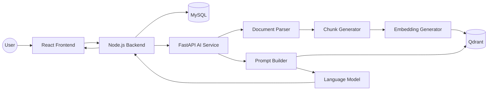

# System Architecture

> Version: 1.0
>
> Status: Active Development
>
> Last Updated: July 2026

---

# Overview

DocMinr.ai is an Enterprise Knowledge Intelligence Platform designed to transform unstructured documents into intelligent, searchable knowledge using Retrieval-Augmented Generation (RAG), semantic retrieval, and Agentic AI.

Unlike traditional "chat with PDF" applications, DocMinr.ai is engineered as a modular platform where every subsystem has a clearly defined responsibility. The architecture emphasizes scalability, maintainability, provider independence, and production-readiness.

The platform separates traditional backend responsibilities from AI-specific workloads by adopting a microservice architecture consisting of:

- React Frontend
- Node.js Backend API
- Python FastAPI AI Service
- MySQL Metadata Database
- Qdrant Vector Database

Each component evolves independently while communicating through well-defined APIs.

---

# Design Goals

The architecture is built around the following objectives:

## Scalability

Individual services should scale independently.

For example:

- AI service can scale horizontally without scaling authentication.
- Upload service can be isolated.
- Vector search can move to dedicated infrastructure.

---

## Modularity

Every subsystem should be replaceable without affecting the rest of the platform.

Examples include:

- OpenAI → Anthropic
- OpenAI → Ollama
- Qdrant → Pinecone
- MySQL → PostgreSQL

The application should require configuration changes rather than architectural rewrites.

---

## Enterprise Ready

The system is designed for enterprise knowledge management rather than simple demonstrations.

Therefore it prioritizes:

- authentication
- authorization
- observability
- auditability
- maintainability
- configuration management

---

## Provider Independence

AI providers evolve rapidly.

The architecture intentionally avoids coupling business logic with any specific LLM provider.

All providers are abstracted behind service layers.

---

## Separation of Concerns

Every service owns a specific responsibility.

Frontend

↓

Presentation

Backend

↓

Business Logic

AI Service

↓

Knowledge Intelligence

Vector Database

↓

Semantic Retrieval

---

# High-Level Architecture

---

# Core Components

The platform is divided into five logical layers.

| Layer | Responsibility |
|---------|----------------|
| Presentation | User Interface |
| Application | Business Logic |
| Intelligence | AI Workflows |
| Storage | Metadata + Vectors |
| Infrastructure | Deployment & Containers |

Each layer has a single responsibility and communicates only through well-defined interfaces.

---

# Component Responsibilities

## React Frontend

Responsibilities:

- Authentication
- Dashboard
- Knowledge Base Management
- File Upload
- Chat Interface
- Document Management

The frontend never communicates directly with the AI service.

All communication passes through the backend API.

This keeps authentication, authorization, validation, and auditing centralized.

---

## Node.js Backend

The backend serves as the orchestration layer.

Responsibilities include:

- Authentication
- Authorization
- User Management
- Knowledge Bases
- Document Upload
- Metadata Management
- API Validation
- File Storage
- Communication with AI Service

Importantly, the backend does **not** perform AI processing.

Its role is orchestration rather than intelligence.

---

## FastAPI AI Service

The AI Service is responsible for every AI-specific workload.

Responsibilities include:

- Document parsing
- Chunk generation
- Embedding creation
- Vector indexing
- Retrieval
- Prompt construction
- Response generation
- Agent execution
- Memory handling

Keeping AI isolated allows rapid experimentation without affecting backend stability.

---

## MySQL

Stores structured business data.

Examples:

- Users
- Organizations
- Knowledge Bases
- Documents
- Metadata
- Processing Status
- Conversation References

MySQL is **not** used for semantic search.

---

## Qdrant

Stores vector embeddings.

Responsibilities:

- Similarity Search
- Top-K Retrieval
- Metadata Filtering
- Semantic Ranking

Only embeddings are stored.

Original documents remain outside the vector database.

---

# Why Two Databases?

This is one of the most important architectural decisions.

MySQL and Qdrant solve different problems.

MySQL excels at:

- relationships
- transactions
- constraints
- business queries

Qdrant excels at:

- nearest neighbour search
- semantic similarity
- vector indexing
- metadata filtering

Trying to use one database for both workloads would compromise performance and maintainability.

The platform therefore adopts a polyglot persistence approach where each database is responsible for the workload it handles best.

---

# Request Lifecycle (Overview)

A user interaction typically follows this sequence:

1. User submits a question.
2. Frontend sends the request to the Backend API.
3. Backend validates authentication and permissions.
4. Backend forwards the request to the AI Service.
5. AI Service generates a query embedding.
6. Qdrant retrieves the most relevant chunks.
7. Prompt Builder assembles context.
8. Language Model generates a response.
9. Backend returns the response to the frontend.

Each stage is isolated, observable, and independently testable.

---

# Architecture Principles

The following principles guide future development:

- Prefer composition over coupling.
- Keep services stateless whenever possible.
- Scale horizontally.
- Design APIs before implementations.
- Treat AI providers as interchangeable.
- Store business data separately from vector data.
- Optimize for maintainability over premature optimisation.
- Build features that can evolve without requiring architectural rewrites.

---

# Future Evolution

The current architecture is intentionally designed to support future capabilities, including:

- Multi-agent orchestration
- Long-term memory
- Hybrid search
- OCR pipelines
- Team collaboration
- Streaming responses
- Event-driven processing
- AWS-native deployment
- Kubernetes orchestration
- Distributed document processing

The architecture should evolve incrementally while preserving backward compatibility and maintaining clear service boundaries.
