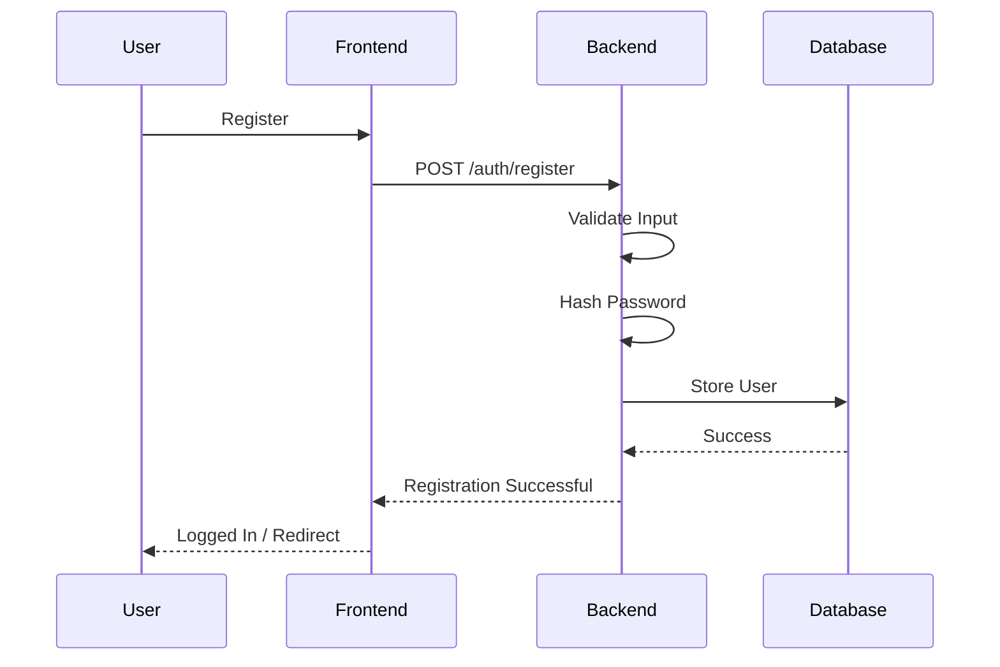
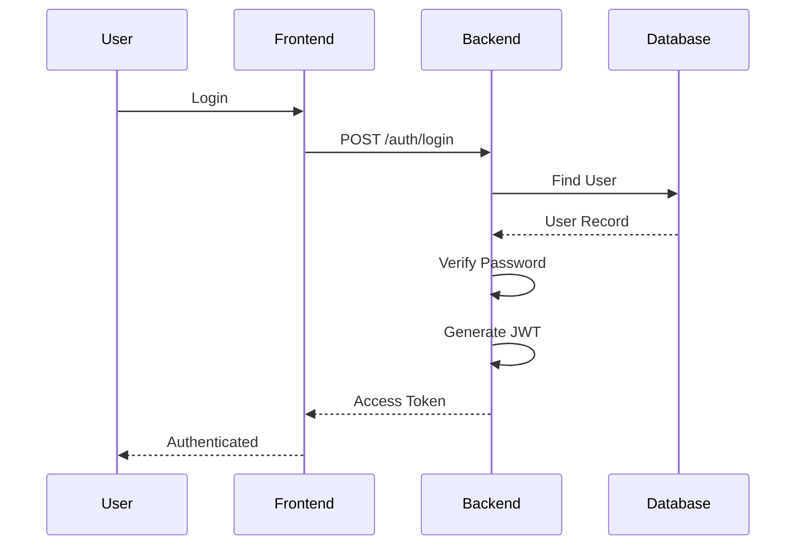

# Authentication & Authorization

> Version: 1.0
>
> Status: Active Development
>
> Last Updated: July 2026

---

# Overview

Authentication is the first security layer of DocMinr.ai. It verifies the identity of users before granting access to protected resources such as knowledge bases, uploaded documents, and AI-powered features.

The platform adopts a **stateless authentication** model using **JSON Web Tokens (JWT)**. This approach enables horizontal scalability, simplifies deployment, and removes the need for server-side session storage.

Authentication answers the question:

> **Who is making this request?**

Authorization answers the question:

> **What is this user allowed to do?**

These concerns are intentionally separated to keep the security model modular and extensible.

---

# Authentication Goals

The authentication system is designed around the following objectives:

- Secure user registration and login
- Stateless request authentication
- Password protection using one-way hashing
- Minimal database lookups for authenticated requests
- Easy horizontal scaling
- Future support for enterprise identity providers

---

# Authentication Flow

The authentication lifecycle consists of five major stages.

```text
Register
    │
    ▼
Hash Password
    │
    ▼
Store User
    │
    ▼
Login
    │
    ▼
Generate JWT
    │
    ▼
Authenticated Requests
```

---

# Registration Flow

When a new user registers:

1. Client submits registration details.
2. Backend validates the request.
3. Password is hashed using a secure hashing algorithm.
4. User record is stored in MySQL.
5. Backend returns a success response.
6. User may be logged in immediately (current implementation) or required to log in separately, depending on application behaviour.



---

# Login Flow

The login process verifies credentials and issues a signed JWT.



---

# Authenticated Request Flow

Every protected API request follows the same validation process.

```text
Client Request
        │
        ▼
Authorization Header
        │
        ▼
JWT Verification
        │
        ▼
Token Valid?
      /     \
    Yes      No
    │         │
    ▼         ▼
Continue   401 Unauthorized
```

If the token is valid, the backend extracts the user identity and attaches it to the request context for downstream handlers.

---

# Why JWT?

Several authentication strategies were evaluated.

## Session-Based Authentication

**Pros**

- Simple
- Easy to invalidate sessions

**Cons**

- Requires server-side session storage
- Harder to scale horizontally
- Additional infrastructure (Redis, etc.)

---

## JWT Authentication (Chosen)

**Pros**

- Stateless
- Scalable
- Widely supported
- Works well with REST APIs
- Suitable for distributed systems

**Cons**

- Token revocation is more complex
- Requires careful expiration management

For the current architecture, the benefits of stateless authentication outweigh the drawbacks.

---

# Password Security

Passwords are **never** stored in plain text.

Instead:

```text
Password

↓

Hashing Algorithm

↓

Password Hash

↓

Database
```

During login:

```text
User Password

↓

Hash

↓

Compare with Stored Hash

↓

Match?
```

Hashing is one-way and irreversible.

Even database administrators cannot recover original passwords.

---

# JWT Structure

A JWT consists of three parts.

```text
Header

.

Payload

.

Signature
```

Example payload:

```json
{
  "userId": "123",
  "email": "user@example.com",
  "role": "user",
  "exp": 1753814400
}
```

Sensitive information should never be stored inside the token payload.

---

# Authorization Middleware

Every protected route passes through authentication middleware.

Responsibilities include:

- Extract JWT
- Verify signature
- Validate expiration
- Load user context
- Reject unauthorized requests

Example flow:

```text
Incoming Request

↓

Auth Middleware

↓

JWT Valid?

↓

Yes

↓

Attach User

↓

Controller

↓

Response
```

This ensures that business logic only executes after authentication succeeds.

---

# Route Protection

The platform distinguishes between public and protected routes.

## Public

- Register
- Login
- Health Check

## Protected

- Knowledge Bases
- Document Upload
- AI Chat
- User Profile
- Conversations

Protected routes require a valid JWT.

---

# Authorization

Authentication alone is not sufficient.

Once a user is authenticated, the system verifies whether they have permission to access the requested resource.

Examples include:

- Accessing only owned knowledge bases
- Uploading documents to authorized workspaces
- Viewing only personal conversations

Future versions will introduce Role-Based Access Control (RBAC) for finer-grained permissions.

---

# Token Expiration

Tokens should have a limited lifetime.

Benefits include:

- Reduced impact of leaked tokens
- Better security posture
- Automatic session expiry

Future implementations may include refresh tokens to provide seamless re-authentication without requiring repeated logins.

---

# Error Handling

Authentication failures return clear and consistent responses.

Examples:

| Status | Reason |
|--------|--------|
| 400 | Invalid request format |
| 401 | Invalid or expired token |
| 403 | Authenticated but insufficient permissions |
| 404 | User not found |
| 500 | Internal server error |

Error messages should be descriptive without exposing sensitive implementation details.

---

# Security Considerations

The authentication layer follows several security principles:

- Passwords are hashed before storage.
- JWT secrets are stored in environment variables.
- Tokens are validated on every protected request.
- Input validation is performed before processing.
- Authentication logic is centralized within middleware.

Future improvements include:

- Refresh Tokens
- Token Rotation
- Multi-Factor Authentication (MFA)
- OAuth 2.0
- OpenID Connect
- Enterprise SSO
- Device Management
- Login History
- Rate Limiting
- Account Lockout Policies

---

# Future Evolution

The authentication system is intentionally designed to evolve alongside the platform.

Planned enhancements include:

- Organization-based authentication
- Team and workspace isolation
- Role-Based Access Control (RBAC)
- API Keys for programmatic access
- Service Accounts
- Audit Trails
- External identity provider integration

These additions can be introduced without changing the overall authentication architecture.

---

# Summary

Authentication in DocMinr.ai is designed to be simple, secure, and scalable.

By adopting stateless JWT authentication, separating authentication from authorization, and planning for future enterprise identity features, the platform establishes a strong security foundation while remaining flexible enough to support future growth.
