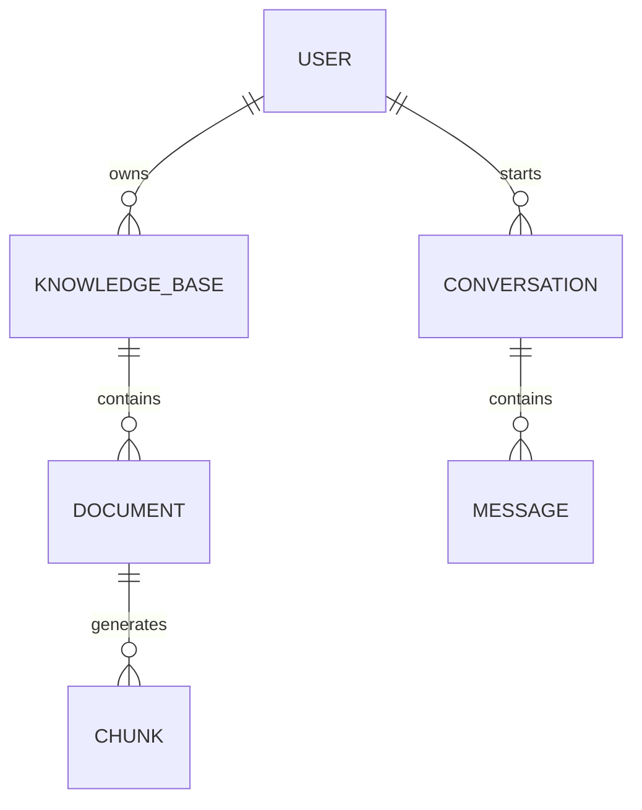

# Database Design

> Version: 1.0
>
> Status: Active Development
>
> Last Updated: July 2026

---

# Overview

DocMinr.ai uses a polyglot persistence architecture where different databases are responsible for different workloads.

Rather than forcing a single database to solve every problem, each storage technology is selected based on its strengths.

| Database | Responsibility |
|----------|----------------|
| MySQL | Structured application data |
| Qdrant | Vector embeddings & semantic retrieval |

This separation improves maintainability, scalability, and performance while allowing each database to focus on the workload it is designed to handle.

---

# Design Principles

The database layer follows several guiding principles.

## Source of Truth

MySQL is the authoritative source for all business entities.

Examples include:

- Users
- Knowledge Bases
- Documents
- Processing Status
- Conversations
- Permissions

Qdrant should never replace MySQL as the primary data store.

---

## Separation of Responsibilities

Business data and AI data are fundamentally different.

Business data requires:

- ACID transactions
- Relationships
- Constraints
- Referential integrity

AI data requires:

- High-dimensional vectors
- Similarity search
- Metadata filtering
- Approximate nearest neighbour search

Keeping them separate allows both systems to perform optimally.

---

# Data Model

The platform revolves around the following core entities.

```text
User
 │
 ├────────────┐
 │            │
 ▼            ▼
Knowledge Base
 │
 ▼
Document
 │
 ▼
Document Chunk
 │
 ▼
Embedding (Qdrant)

Conversation
 │
 ▼
Messages
```

---

# Entity Overview

## User

Represents an authenticated account.

Responsibilities:

- Identity
- Authentication
- Ownership
- Permissions

Example attributes:

- id
- name
- email
- password_hash
- role
- created_at

---

## Knowledge Base

A logical collection of related documents.

Examples:

- Employee Handbook
- Product Documentation
- Customer Contracts
- Engineering Wiki

Each knowledge base belongs to exactly one user (or organisation in future versions).

Example attributes:

- id
- owner_id
- name
- description
- visibility
- created_at

---

## Document

Represents a file uploaded by a user.

A document stores metadata rather than embeddings.

Example attributes:

- id
- knowledge_base_id
- filename
- original_name
- mime_type
- size
- upload_status
- processing_status
- created_at

The document acts as the parent entity for all generated chunks.

---

## Document Chunk

A document is divided into smaller semantic units before embedding.

Each chunk references:

- its parent document
- its position
- original text
- metadata

Example attributes:

- id
- document_id
- chunk_index
- content
- token_count
- page_number
- section_heading

The chunk is the fundamental unit used during retrieval.

---

## Conversation

Represents an AI chat session.

Stores metadata only.

Example attributes:

- id
- user_id
- knowledge_base_id
- title
- created_at

Messages are stored separately.

---

## Message

Stores individual interactions.

Example:

User:

> How does the authentication flow work?

Assistant:

> Authentication uses JWT...

Example attributes:

- id
- conversation_id
- role
- content
- timestamp

---

# Entity Relationships



---

# Why Chunks Are Stored Separately

A document may contain hundreds of chunks.

Embedding an entire document into a single vector would:

- reduce retrieval quality
- exceed model context windows
- decrease semantic precision

Instead, each chunk is treated as an independent retrieval unit.

Benefits include:

- Better search accuracy
- Smaller prompts
- Faster retrieval
- Lower token costs
- Fine-grained citations

---

# Vector Storage (Qdrant)

Each chunk produces exactly one vector embedding.

Stored fields include:

```text
Vector

Metadata
    document_id
    knowledge_base_id
    chunk_id
    page
    source
```

The original document remains stored outside Qdrant.

Qdrant only stores vectors and lightweight metadata required for retrieval.

---

# Processing Status

Each uploaded document moves through several processing stages.

```text
UPLOADED

↓

PARSING

↓

CHUNKING

↓

EMBEDDING

↓

INDEXING

↓

READY
```

Possible failure states:

- FAILED
- RETRYING
- CANCELLED

Tracking processing status enables resumable and observable ingestion workflows.

---

# Indexing Strategy

The relational database should define indexes based on common query patterns.

Recommended indexes include:

| Table | Index |
|--------|-------|
| users | email |
| knowledge_bases | owner_id |
| documents | knowledge_base_id |
| documents | processing_status |
| conversations | user_id |
| messages | conversation_id |

Indexes should be added only after analysing expected access patterns.

---

# Soft Deletes

Documents should not be permanently removed immediately.

Instead:

- mark as deleted
- exclude from queries
- remove associated vectors asynchronously
- perform permanent cleanup through background jobs

This approach improves recoverability and prevents accidental data loss.

---

# Future Schema Evolution

The current schema is intentionally simple but designed to support future enhancements.

Planned additions include:

- Organisations
- Teams
- Role-Based Access Control (RBAC)
- Shared Knowledge Bases
- Tags
- Collections
- Audit Logs
- API Keys
- Usage Analytics
- Feedback Records
- Agent Memory
- Workflow Definitions

These features can be introduced without major structural changes because the schema follows clear ownership and separation principles.

---

# Database Philosophy

The database is not merely a storage layer.

It is the foundation upon which retrieval, reasoning, and collaboration are built.

By separating structured business data from semantic vector data, DocMinr.ai achieves a balance between traditional application architecture and modern AI-native workflows.

This design allows the platform to evolve from a document retrieval system into a comprehensive enterprise knowledge intelligence platform.
