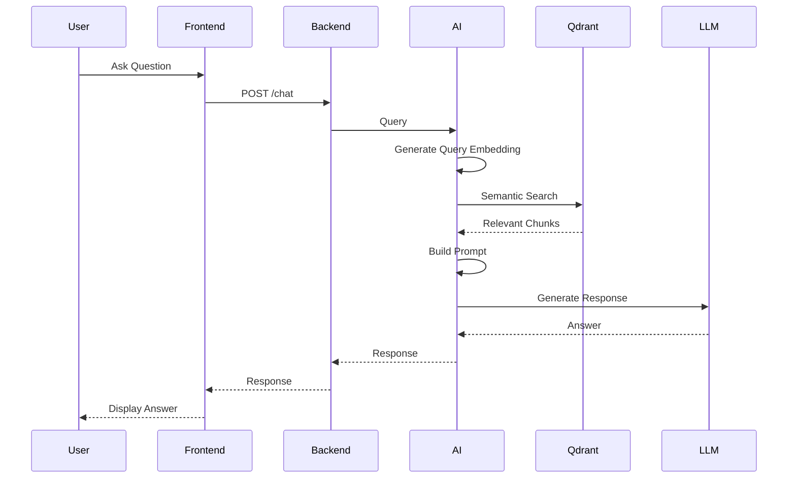

# Retrieval-Augmented Generation (RAG) Pipeline

> Version: 1.0
>
> Status: Active Development
>
> Last Updated: July 2026

---

# Overview

Retrieval-Augmented Generation (RAG) is the core intelligence architecture behind DocMinr.ai.

Rather than asking a Large Language Model (LLM) to answer questions solely from its pre-trained knowledge, the platform first retrieves relevant information from an organization's knowledge base and supplies that information as context to the model.

This approach enables the system to produce responses grounded in enterprise documents while reducing hallucinations and improving factual accuracy.

RAG transforms static document collections into an interactive knowledge system capable of answering questions using organisational data rather than relying exclusively on the language model's internal knowledge.

---

# Why Retrieval-Augmented Generation?

Large Language Models possess broad general knowledge but have important limitations.

They:

- Cannot access private enterprise documents by default
- May generate incorrect or fabricated information
- Have knowledge cut-off dates
- Cannot reliably answer organisation-specific questions

Examples:

Question:

```
What is our employee leave policy?
```

Without retrieval:

```
LLM

↓

Guesses

↓

Potential Hallucination
```

With retrieval:

```
Knowledge Base

↓

Relevant Chunks

↓

Prompt

↓

Grounded Response
```

The retrieved context provides factual grounding before generation begins.

---

# High-Level Pipeline

Every user question follows the same lifecycle.

```text
User Question

↓

Authentication

↓

Knowledge Base Validation

↓

Query Embedding

↓

Vector Search

↓

Top-K Retrieval

↓

Metadata Filtering

↓

Context Assembly

↓

Prompt Construction

↓

Language Model

↓

Grounded Response

↓

Frontend
```

Each stage performs a single responsibility and contributes to the final answer.

---

# Pipeline Stages

## Stage 1 — User Query

The user submits a natural language question through the chat interface.

Example:

> How is document processing handled?

The frontend forwards the request to the backend for validation.

---

## Stage 2 — Authentication & Authorization

The backend verifies:

- User identity
- Access token validity
- Knowledge base permissions

Only authorised users can retrieve information from protected knowledge bases.

---

## Stage 3 — Query Embedding

The user's question is converted into a dense vector representation.

```text
Question

↓

Embedding Model

↓

Semantic Vector
```

The resulting vector represents the meaning of the question rather than the exact words used.

---

## Stage 4 — Semantic Retrieval

The query vector is compared against vectors stored in Qdrant.

The retrieval engine identifies the most semantically relevant document chunks.

Additional filters may include:

- Knowledge Base
- Document Type
- Tags
- Language
- User Permissions

---

## Stage 5 — Context Selection

The retrieved chunks are ranked and assembled into a context window.

Selection balances:

- Relevance
- Diversity
- Token budget
- Metadata consistency

The objective is to provide the language model with sufficient context while avoiding unnecessary information.

---

## Stage 6 — Prompt Construction

Retrieved context is combined with system instructions and the user's question.

Example structure:

```text
System Instructions

↓

Retrieved Context

↓

Conversation History

↓

User Question
```

Prompt construction plays a significant role in ensuring reliable and consistent responses.

---

## Stage 7 — Response Generation

The language model generates an answer using:

- System instructions
- Retrieved document context
- User question
- Conversation history (when applicable)

The model is instructed to rely on retrieved information rather than unsupported assumptions.

---

## Stage 8 — Response Delivery

The generated response is returned to the backend and forwarded to the frontend.

Future versions may include:

- Source citations
- Confidence indicators
- Streaming responses
- Follow-up question suggestions

---

# End-to-End Sequence



---

# Prompt Structure

A typical prompt consists of four sections.

```text
System Instructions

+

Retrieved Context

+

Conversation History

+

Current User Question
```

Separating these sections improves clarity and makes prompt engineering more maintainable.

---

# Context Window Management

Language models have finite context windows.

Therefore, retrieved information must be carefully selected.

The platform considers:

- Maximum token limits
- Chunk relevance
- Duplicate removal
- Metadata consistency
- Context diversity

Future versions may introduce adaptive context selection based on model capabilities.

---

# Hallucination Mitigation

A primary objective of the RAG pipeline is to reduce hallucinations.

Strategies include:

- Grounding responses in retrieved content
- Restricting responses to available context
- Rejecting unsupported claims
- Returning "insufficient information" when necessary

The system prioritises correctness over completeness.

---

# Multi-Turn Conversations

Future versions will support conversation-aware retrieval.

Instead of treating each question independently, the system will consider previous interactions.

Example:

```
User:

Explain JWT authentication.

↓

User:

How long do they last?
```

The second query depends on conversational context.

Conversation memory will help preserve continuity across multiple interactions.

---

# Failure Handling

Possible failure scenarios include:

- No matching documents
- Empty knowledge base
- Embedding service failure
- Vector database unavailable
- LLM timeout
- Token limit exceeded

The platform should:

- Return meaningful messages
- Avoid fabricated responses
- Log diagnostic information
- Support retry mechanisms where appropriate

---

# Token Budgeting

Efficient token usage improves both latency and operational cost.

The context builder should balance:

- Number of retrieved chunks
- Prompt size
- Conversation history
- Expected response length

Future implementations may dynamically allocate token budgets based on the selected language model.

---

# Engineering Decisions

### Retrieval Before Generation

The language model should always receive relevant context before attempting to answer enterprise-specific questions.

---

### Context Over Memorisation

Enterprise knowledge should come from the knowledge base rather than the model's internal memory.

---

### Modular Pipeline

Each stage of the RAG pipeline is implemented independently, allowing components such as embedding models, vector databases, or language models to be replaced without redesigning the system.

---

### Provider Independence

The pipeline should support multiple language model and embedding providers through abstraction layers.

---

### Observable Workflow

Every stage should expose logs, metrics, and processing status to simplify monitoring and debugging.

---

# Future Enhancements

The RAG pipeline is designed to evolve as the platform grows.

Planned capabilities include:

- Hybrid Retrieval (Dense + Sparse)
- Cross-Encoder Re-ranking
- Agent-Based Retrieval
- Multi-Query Retrieval
- Parent-Child Retrieval
- Graph-Augmented Retrieval
- Multimodal Retrieval
- Adaptive Prompt Construction
- Streaming Generation
- Citation Generation
- Confidence Scoring

These enhancements will improve retrieval quality, scalability, and user trust while maintaining a modular architecture.

---

# Summary

The Retrieval-Augmented Generation pipeline is the intelligence engine of DocMinr.ai.

By combining semantic retrieval, contextual prompt construction, and grounded language model generation, the platform delivers responses that are accurate, explainable, and based on organisational knowledge rather than unsupported assumptions.

The modular architecture allows each stage of the pipeline to evolve independently while providing a scalable foundation for future AI capabilities such as agents, memory, multimodal search, and enterprise automation.
