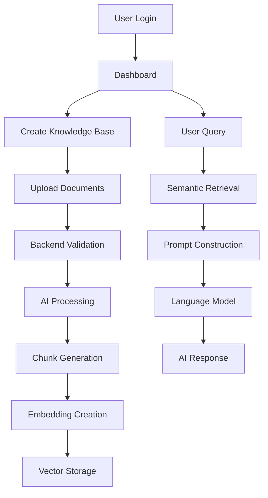

# System Overview

> Version: 1.0
>
> Status: Active Development

---

# Introduction

DocMinr.ai is an Enterprise Knowledge Intelligence Platform that enables organizations to transform unstructured documents into searchable, AI-powered knowledge.

The platform combines modern backend engineering with Retrieval-Augmented Generation (RAG) to allow users to upload documents, organize them into knowledge bases, and query them using natural language.

Rather than functioning as a single application, DocMinr.ai is composed of multiple services working together to deliver a seamless experience.

---

# System Objectives

The platform is designed to solve four primary problems.

## 1. Knowledge Organization

Organizations often store information across PDFs, Word documents, manuals, reports, and spreadsheets.

DocMinr.ai centralizes this information into structured knowledge bases.

---

## 2. Semantic Retrieval

Instead of relying on keyword matching, the platform retrieves documents based on semantic meaning using vector embeddings.

This enables users to ask questions naturally while receiving contextually relevant responses.

---

## 3. AI-Assisted Understanding

Retrieved document context is combined with a Large Language Model (LLM) to generate accurate, context-aware answers grounded in the organization's own knowledge.

---

## 4. Extensible AI Platform

The system is designed to support future AI capabilities such as:

- Multi-agent reasoning
- Workflow automation
- Long-term memory
- Enterprise copilots
- Knowledge analytics

---

# Core User Journey

A typical user interacts with the platform through five stages.

```text
Authentication
        │
        ▼
Knowledge Base Creation
        │
        ▼
Document Upload
        │
        ▼
Document Processing
        │
        ▼
AI-powered Search & Chat
```

Each stage builds upon the previous one while remaining independently scalable.

---

# End-to-End System Flow



---

# User Authentication Flow

Every request begins with authentication.

The authentication service is responsible for:

- User registration
- Login
- Token generation
- Session validation
- Permission checks

The backend validates the user's identity before allowing access to any knowledge base or AI functionality.

---

# Knowledge Base Lifecycle

Knowledge bases are the central organizational unit within DocMinr.ai.

Each knowledge base groups related documents under a common purpose.

Examples include:

- HR Policies
- Engineering Documentation
- Customer Support
- Legal Contracts
- Product Manuals

Documents are always associated with a specific knowledge base, ensuring retrieval remains contextually relevant.

---

# Document Lifecycle

Every uploaded document progresses through a defined processing pipeline.

```text
Upload

↓

Validation

↓

Storage

↓

Metadata Extraction

↓

Parsing

↓

Chunk Generation

↓

Embedding Creation

↓

Vector Indexing

↓

Ready for Search
```

The document becomes searchable only after successful completion of the entire pipeline.

---

# AI Query Lifecycle

When a user submits a question, the platform performs several coordinated steps.

1. Receive the user's query.
2. Verify authentication and access permissions.
3. Generate a semantic embedding for the query.
4. Search the vector database for relevant document chunks.
5. Rank and filter retrieved results.
6. Construct a prompt using retrieved context.
7. Send the prompt to the language model.
8. Receive the generated response.
9. Return the answer to the frontend.

This pipeline ensures responses are grounded in organizational knowledge rather than relying solely on the language model's pre-trained knowledge.

---

# Service Responsibilities

## Frontend

Responsible for:

- User interface
- Dashboard
- Authentication screens
- File uploads
- Chat interface
- Knowledge base management

---

## Backend

Responsible for:

- Authentication
- Business rules
- Metadata storage
- Authorization
- API validation
- Communication with AI services

---

## AI Service

Responsible for:

- Document parsing
- Chunk generation
- Embeddings
- Vector search
- Prompt engineering
- LLM orchestration
- Agent workflows

---

## MySQL

Stores structured application data.

Examples include:

- Users
- Documents
- Knowledge bases
- Upload status
- Processing metadata

---

## Qdrant

Stores vector embeddings used for semantic similarity search.

The vector database never replaces the primary relational database.

Instead, it complements it by enabling efficient retrieval based on meaning.

---

# Communication Between Services

The platform follows a request-response communication model.

```text
Frontend
     │
     ▼
Backend API
     │
     ▼
FastAPI AI Service
     │
     ▼
Vector Database
     │
     ▼
Language Model
```

Each service communicates through well-defined APIs, allowing independent deployment and scaling.

---

# Error Handling Strategy

The platform is designed to fail gracefully.

Examples include:

- Invalid uploads are rejected before processing.
- Failed embedding jobs are retried.
- AI provider failures return meaningful error messages.
- Missing documents never crash the application.
- Partial failures are logged for investigation.

This approach improves reliability while simplifying debugging and monitoring.

---

# Scalability Considerations

The architecture supports future scaling through:

- Stateless backend services
- Independent AI workers
- Background document processing
- Horizontal scaling
- Containerized deployments
- Cloud-native infrastructure

Each subsystem can be scaled independently according to workload.

---

# Future Vision

DocMinr.ai is being developed as more than a document search application.

Future versions aim to support:

- Multi-agent collaboration
- Team workspaces
- Knowledge graphs
- Workflow automation
- AI copilots
- Enterprise integrations
- Streaming responses
- Observability dashboards

The long-term vision is to provide a reusable platform for building intelligent enterprise applications powered by organizational knowledge.
